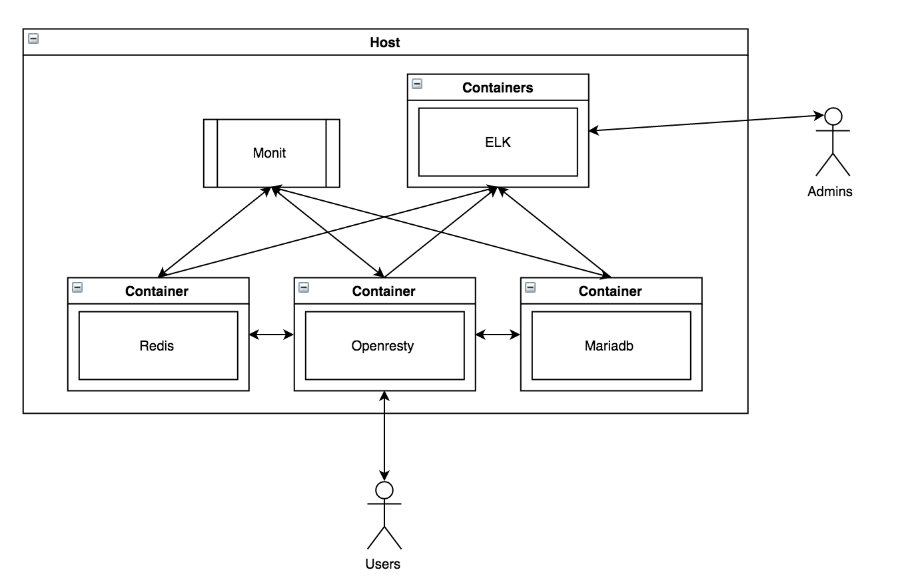

# Restful Api Server

### Overview

### Components
- docker: virtualization and isolation
- Nginx (Openresty) docker container: https web server, load balancer
- Redis docker container: cache
- MariaDB docker container: database
- ELK docker containers: aggregate & analyze dockers' log
- monit: process monitor
- fail2ban

### Features
> TODO

### Project files

- [server_para_tuning.sh](./server_para_tuning.sh): Basic TCP & OS kernel parameters tunings.
- [setup_base_env.sh](./setup_base_env.sh): Setup the basic docker host environment and install ELK contains.
- [mariadb.cnf](./mariadb.cnf): the conf file for mariadb.
- [redis.conf](./redis.conf): the conf file for redis.
- [ngx](./ngx): folder containing Dockerfile & confs for nginx container.
    + [Dockerfile](./ngx/Dockerfile): the dockerfile for building the openresty image.
    + [conf](./ngx/conf): containing the conf files
        * [nginx.conf](./ngx/conf/nginx.conf): the nginx conf file.
        * [loc.basic.conf](./ngx/conf/loc.basic.conf): some test locations for nginx.
        * [loc.cache.conf](./ngx/conf/loc.cache.conf): internal cache locations.
        * [basic.cache.conf](./ngx/conf/basic.cache.conf): shortcuts to get/put data from/to cache.
- [monit.conf](./monit.conf): systemd minit conf file.
- [monitrc](./monitrc): monit monitoring conf file.

### Setup
> TODO

### Production environment considerations
> TODO
